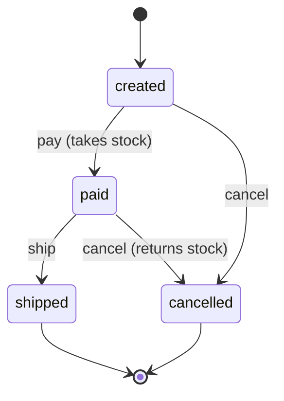

# orders-api-ts

> Orders API in TypeScript built test-first: Fastify, Zod, Drizzle and PostgreSQL, with Vitest + Testcontainers integration tests, enforced coverage, Docker and GitHub Actions CI.


[](https://github.com/joaoclaudioprestes/orders-api-ts/actions/workflows/ci.yml)


---

## Stack

| Layer                | Technology                                                                                                            |
| -------------------- | --------------------------------------------------------------------------------------------------------------------- |
| HTTP                 | [Fastify](https://fastify.dev/) + [fastify-type-provider-zod](https://github.com/turkerdev/fastify-type-provider-zod) |
| Validation / OpenAPI | [Zod](https://zod.dev/) + [@fastify/swagger](https://github.com/fastify/fastify-swagger)                              |
| Persistence          | [PostgreSQL](https://www.postgresql.org/) via [Drizzle ORM](https://orm.drizzle.team/)                                |
| Package manager      | [npm](https://docs.npmjs.com/)                                                                                        |
| Linter / Formatter   | [ESLint](https://eslint.org/) + [Prettier](https://prettier.io/)                                                      |
| Tests                | [Vitest](https://vitest.dev/) + [Testcontainers](https://testcontainers.com/)                                         |
| CI / Runtime         | [GitHub Actions](https://github.com/features/actions) + [Docker](https://www.docker.com/)                             |

---

## Architecture

The project follows a layered architecture with clear separation of concerns:

```
Routes (Fastify + Zod)
  └── Services (business logic)
        └── Repositories (interface)
              └── PostgreSQL (Drizzle) / in-memory (unit tests)
```

```
src/
├── app.ts                  # buildApp: plugins, error handler, /health, /docs
├── server.ts               # entry point: env, migrations, wiring, listen
├── env.ts                  # env validation (Zod)
├── db/
│   └── schema.ts           # Drizzle tables
├── products/
│   ├── schema.ts           # Zod schemas
│   ├── routes.ts           # CRUD routes
│   ├── service.ts          # product rules
│   ├── repository.ts       # repository interface
│   ├── postgres-repository.ts
│   └── memory-repository.ts
├── orders/
│   ├── schema.ts           # Zod schemas + statuses
│   ├── routes.ts           # create · list · get · pay · ship · cancel
│   ├── service.ts          # state machine + stock rules
│   ├── repository.ts       # repository / transactor interface
│   ├── postgres-repository.ts
│   └── memory-repository.ts
├── test/
│   └── global-setup.ts     # starts the Postgres container
└── *.test.ts               # app, env and Postgres integration tests
```

### Order lifecycle



- Any other transition returns `409 Conflict`.
- Prices are snapshotted into the order on creation (`unitPrice`), so later product price changes do not alter existing orders.
- Stock is taken on payment, not on creation; paying without enough stock returns `409`.
- `DELETE /products/:id` returns `409` while a `created` or `paid` order references the product; products only in `shipped`/`cancelled` orders can be deleted.
- Each order operation runs inside a single database transaction: the status change and the stock update commit or roll back together.

### Design decisions

- Services depend on repository interfaces; unit tests use in-memory implementations, integration tests use real Postgres.
- Zod schemas are the single source of truth: they validate requests, serialize responses and generate the OpenAPI docs.
- Domain errors are mapped to HTTP status codes in one central error handler.

### Error responses

| Status | When                                                      | Body                                          |
| ------ | --------------------------------------------------------- | --------------------------------------------- |
| `400`  | invalid body or params (Zod)                              | `{"message":"Validation error","issues":[…]}` |
| `404`  | product or order not found                                | `{"message":"Order <id> not found"}`          |
| `409`  | invalid transition, insufficient stock, or product in use | `{"message":"Cannot go from paid to paid"}`   |
| `500`  | unexpected error (logged server-side)                     | `{"message":"Internal server error"}`         |

### Known limitations

- No authentication or pagination — out of scope for this project.

---

## Installation

**Prerequisites:** [Docker](https://docs.docker.com/get-docker/) (to run the API) — plus [Node.js 22+](https://nodejs.org/) for local development.

```sh
git clone https://github.com/joaoclaudioprestes/orders-api-ts.git
cd orders-api-ts
docker compose up --build
```

The API listens on `http://localhost:3000`; Swagger UI is at `http://localhost:3000/docs`. Migrations run on startup.

Environment variables (validated at startup):

| Variable       | Default      | Description                  |
| -------------- | ------------ | ---------------------------- |
| `DATABASE_URL` | — (required) | PostgreSQL connection string |
| `PORT`         | `3000`       | HTTP port                    |

---

## Usage

```
$ curl localhost:3000/health
{"status":"ok"}

$ curl -X POST localhost:3000/products -H 'content-type: application/json' \
    -d '{"name":"Keyboard","price":120.5,"stock":10}'
{"name":"Keyboard","price":120.5,"stock":10,"id":"c4f7bb67-7cdc-4a77-9f66-044b5dc72bbb"}

$ curl -X POST localhost:3000/orders -H 'content-type: application/json' \
    -d '{"items":[{"productId":"c4f7bb67-7cdc-4a77-9f66-044b5dc72bbb","quantity":2}]}'
{"id":"583e2ede-8b1e-45a5-a984-6f0540b89aae","status":"created","items":[{"productId":"c4f7bb67-7cdc-4a77-9f66-044b5dc72bbb","quantity":2,"unitPrice":120.5}],"total":241}

$ curl -X POST localhost:3000/orders/583e2ede-8b1e-45a5-a984-6f0540b89aae/pay
{"id":"583e2ede-8b1e-45a5-a984-6f0540b89aae","status":"paid","items":[...],"total":241}

$ curl -X POST localhost:3000/orders/583e2ede-8b1e-45a5-a984-6f0540b89aae/pay
{"message":"Cannot go from paid to paid"}
```

### Endpoints

```
GET    /health
POST   /products          GET /products          GET /products/:id
PATCH  /products/:id      DELETE /products/:id
POST   /orders            GET /orders            GET /orders/:id
POST   /orders/:id/pay    POST /orders/:id/ship  POST /orders/:id/cancel
```

---

## Development

```sh
npm ci
```

| Command                           | Description                                    |
| --------------------------------- | ---------------------------------------------- |
| `npm run build`                   | compile TypeScript to `dist/`                  |
| `npm start`                       | run the compiled server (needs `DATABASE_URL`) |
| `npm run lint`                    | ESLint                                         |
| `npm run format` / `format:check` | Prettier write / check                         |
| `npm run typecheck`               | `tsc --noEmit`                                 |
| `npm test`                        | run the test suite                             |
| `npm run test:coverage`           | tests + coverage gate                          |

### Tests

45 tests in 6 files, Docker required:

- **Unit:** services against in-memory repositories (state machine, stock rules, validation).
- **Integration:** a real PostgreSQL container via Testcontainers — no database mocks.
- **Coverage gate:** enforced by Vitest (last run: 97.9% statements, 90.4% branches, 98.7% functions, 98.8% lines).

CI (GitHub Actions) runs on every push:

```
npm ci → format:check → lint → typecheck → test:coverage
```

---

## License

[MIT](LICENSE)
